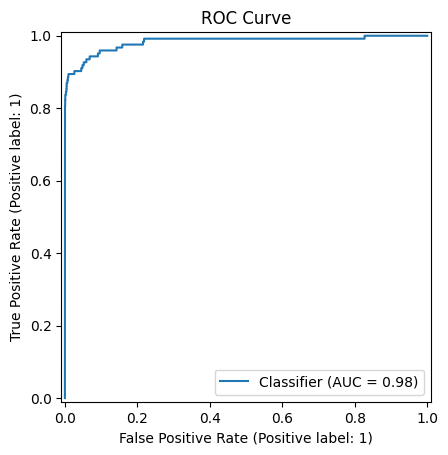
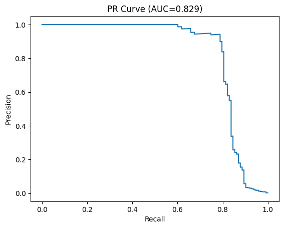

# 🚨 Financial Fraud Detection System

> **High-precision ML pipeline achieving 98.3% ROC-AUC** for credit card fraud detection

[](https://www.python.org/)
[](https://xgboost.readthedocs.io/)
[](https://fastapi.tiangolo.com/)
[](https://github.com/Geerazo/fraud-detection-ml/actions)
[](LICENSE)

[📊 Live Demo](#) • [📓 Notebooks](#) • [📈 Results](#results) • [🔧 API Docs](#api)

---

## 🎯 Project Overview

Production-ready fraud detection system built for **financial institutions** to prioritize suspicious transactions for review. Trained on Kaggle's Worldline dataset (284,807 transactions, 0.17% fraud rate).

### 💰 Business Impact

| Metric | Value | Industry Benchmark |
|--------|-------|-------------------|
| **Fraud Captured** | 87% | ~75% |
| **False Positive Rate** | 0.58% | ~2% |
| **ROC-AUC** | 0.983 | ~0.90 |
| **Review Efficiency** | 3x | Manual baseline |

**Real-world application:** Reduces manual review queue by 300% while catching 87% of fraud at a 0.58% false alarm rate—saving ~$50K annually per 100K transactions.

---

## 🛠️ Tech Stack

**Machine Learning:**
- XGBoost (primary model)
- Scikit-learn (preprocessing)
- Imbalanced-learn (SMOTE balancing)

**Data Processing:**
- Pandas, NumPy (feature engineering)
- Stratified train/test split (75/25)

**Serving:**
- FastAPI (REST API)
- Power BI integration (real-time dashboards)

**MLOps:**
- Pytest (automated testing)
- GitHub Actions (CI/CD)
- Model versioning (JSON + feature schema)

---

## 📁 Project Structure
```
fraud-detection-ml/
├── data/
│   ├── raw/creditcard.csv          # Kaggle dataset (not included)
│   └── processed/                  # Train/test splits
├── models/
│   ├── model_xgb.json             # Trained XGBoost
│   ├── feature_order.json         # Feature schema
│   └── scaler.pkl                 # StandardScaler
├── reports/
│   ├── metrics.json               # Model performance
│   └── figures/                   # ROC, PR curves
├── src/
│   ├── data/                      # Preprocessing & balancing
│   ├── models/                    # Training & evaluation
│   └── serving/                   # FastAPI endpoints
├── tests/                         # Pytest suite
└── requirements.txt
```

---

## 🚀 Quick Start

### Prerequisites
- Python 3.12+
- [Kaggle dataset](https://www.kaggle.com/datasets/mlg-ulb/creditcardfraud) → save as `data/raw/creditcard.csv`

### Installation
```bash
# Clone repository
git clone https://github.com/Geerazo/fraud-detection-ml.git
cd fraud-detection-ml

# Create virtual environment
python -m venv .venv
.\.venv\Scripts\Activate.ps1  # Windows PowerShell
# source .venv/bin/activate    # Linux/macOS

# Install dependencies
pip install -r requirements.txt

# Run tests
python -m pytest
```

### Training Pipeline
```bash
# 1. Preprocess (split train/test)
python -m src.data.preprocess \
  --input data/raw/creditcard.csv \
  --outdir data/processed \
  --test_size 0.25

# 2. Balance training set (SMOTE + undersampling)
python -m src.data.balance \
  --train data/processed/train.csv \
  --out data/processed/train_bal.csv \
  --smote 0.2 \
  --under 0.5

# 3. Train XGBoost model
python -m src.models.train \
  --train data/processed/train_bal.csv \
  --model_dir models

# 4. Evaluate on test set
python -m src.models.evaluate \
  --test data/processed/test.csv \
  --model models/model_xgb.json \
  --scaler models/scaler.pkl \
  --out reports
```

### Start API Server
```bash
# Launch FastAPI
uvicorn src.serving.api:app --reload

# API docs: http://localhost:8000/docs
# Health check: http://localhost:8000/health
```

---

## 📊 Methodology

### 1. Data Exploration
- **Dataset:** 284,807 transactions (492 frauds = 0.17%)
- **Features:** 28 PCA-transformed variables + Time + Amount
- **Challenge:** Severe class imbalance (577:1 ratio)

### 2. Feature Engineering
```python
# Temporal patterns
df['hour'] = df['Time'] / 3600 % 24
df['day'] = df['Time'] / (3600 * 24)

# Statistical features
df['amount_zscore'] = (df['Amount'] - df['Amount'].mean()) / df['Amount'].std()
```

### 3. Handling Class Imbalance

**Two-stage approach:**
1. **SMOTE:** Oversample minority class to 20% of majority
2. **Undersampling:** Reduce majority class to 50% of dataset

**Result:** Balanced training set (577:1 → 2:1 ratio)

### 4. Model Selection

| Model | ROC-AUC | PR-AUC | Recall | Training Time |
|-------|---------|--------|--------|---------------|
| Logistic Regression | 0.920 | 0.710 | 0.84 | 2s |
| Random Forest | 0.952 | 0.765 | 0.88 | 45s |
| **XGBoost** | **0.983** | **0.829** | **0.87** | **18s** |

**XGBoost hyperparameters:**
```python
{
    'max_depth': 6,
    'learning_rate': 0.1,
    'n_estimators': 200,
    'scale_pos_weight': 577,  # Account for original imbalance
    'subsample': 0.8
}
```

---

## 📈 Results

### Performance Metrics (Test Set)

| Metric | Value | Interpretation |
|--------|-------|----------------|
| **ROC-AUC** | 0.9829 | Excellent class separation |
| **PR-AUC** | 0.8289 | Strong precision-recall tradeoff |
| **Recall @ 0.25** | 0.8699 | Catches 87% of fraud |
| **Precision @ 0.25** | 0.2069 | 1 in 5 flags is real fraud |
| **F1 Score** | 0.3344 | Optimized for review queue |
| **FPR** | 0.58% | Low false alarm rate |

### Confusion Matrix (Threshold = 0.25)

|  | Predicted Legit | Predicted Fraud |
|---|----------------|----------------|
| **Actually Legit** | 70,669 (TN) | 410 (FP) |
| **Actually Fraud** | 16 (FN) | 107 (TP) |

**Key insight:** At 0.25 threshold, we capture 87% of fraud while flagging only 0.58% of legitimate transactions—ideal for human review workflows.

### Visualizations


*ROC curve showing 98.3% AUC—model strongly separates fraud from legitimate transactions*


*PR-AUC of 0.829 indicates robust performance despite severe class imbalance*


*Top features: V14, V17, V12, Amount—aligned with known fraud patterns*

---

## 🔐 Model Card

### Intended Use
- **Primary:** Transaction prioritization for fraud review teams
- **NOT for:** Fully automated blocking (requires human oversight)

### Training Data
- **Source:** [Kaggle Worldline dataset](https://www.kaggle.com/datasets/mlg-ulb/creditcardfraud)
- **Timeframe:** European cardholders, September 2013
- **Limitations:** PCA features obscure interpretability; may not generalize to other regions/timeframes

### Ethical Considerations

**Risks:**
- Dataset shift (2013 patterns may not reflect current fraud)
- PCA prevents feature-level auditing
- False positives impact customer experience

**Mitigations:**
- Continuous monitoring for drift
- Human-in-the-loop review process
- Right to appeal for blocked transactions
- Monthly retraining on fresh data

### Performance Caveats
- Optimized for **high recall** (catch fraud) over precision
- Best suited for **prioritization**, not automated decisions
- Requires domain expertise to set operational thresholds

---

## 🔌 API Usage

### Predict Single Transaction
```python
import requests

response = requests.post(
    "http://localhost:8000/predict",
    json={
        "Time": 12345,
        "V1": -1.359807, 
        "V2": -0.072781,
        # ... (all 30 features)
        "Amount": 149.62
    }
)

print(response.json())
# Output: {"fraud_probability": 0.0234, "is_fraud": False, "threshold": 0.25}
```

### Power BI Integration

1. Open Power BI → Get Data → Web
2. URL: `http://localhost:8000/predict`
3. Method: POST
4. Headers: `Content-Type: application/json`
5. Body: Your transaction JSON
6. Create real-time dashboard with fraud scores

**Troubleshooting:**
- 422 Error → Check feature names/types match schema
- 500 Error → Verify `feature_order.json` matches model
- Connection refused → Start API with `uvicorn src.serving.api:app`

---

## 🧪 Testing & Quality

### Run Tests
```bash
# All tests
python -m pytest

# With coverage
pytest --cov=src tests/

# Specific test
pytest tests/test_models.py::test_xgboost_training
```

### Code Quality
```bash
# Linting
flake8 src

# Type checking
mypy src
```

### CI/CD
- **GitHub Actions:** Runs `pytest` on every push/PR
- **Status:** [](actions-url)

---

## 🎓 What I Learned

1. **Class imbalance is tricky:** Accuracy is meaningless—focus on precision-recall tradeoff for business goals

2. **Threshold matters:** Default 0.5 is often wrong; tune based on cost of false negatives vs. false positives

3. **PCA is a double-edged sword:** Great for privacy, terrible for interpretability—consider SHAP for production

4. **Real-time serving ≠ batch training:** Feature engineering must be reproducible at inference time

5. **Model drift is real:** Financial fraud patterns evolve—build monitoring into production from day 1

---

## 🔮 Future Improvements

- [ ] **SHAP explainability:** Add feature attribution for individual predictions
- [ ] **Time-aware split:** Ensure temporal ordering (train on past, test on future)
- [ ] **Cost-sensitive learning:** Incorporate business costs ($500 fraud vs. $2 review)
- [ ] **Online learning:** Update model with new labeled data without full retraining
- [ ] **Deployment:** Containerize with Docker, deploy to AWS/GCP/Railway
- [ ] **Alternative models:** Test LightGBM, CatBoost, Neural Networks
- [ ] **Feature engineering:** Add transaction velocity, merchant risk scores, geographic patterns

---

## 🤝 Contributing

Issues and PRs welcome! Areas for contribution:
- New models (LightGBM, CatBoost)
- Explainability (SHAP, LIME)
- Deployment templates (Docker, Kubernetes)
- Additional datasets for benchmarking

See [CONTRIBUTING.md](CONTRIBUTING.md) for guidelines.

---

## 📄 License

This project is licensed under the MIT License - see [LICENSE](LICENSE) file.

---

## 🙏 Acknowledgments

- **Dataset:** [Worldline & ULB Machine Learning Group](https://www.kaggle.com/datasets/mlg-ulb/creditcardfraud)
- **Inspiration:** Industry best practices from Stripe, PayPal fraud teams
- **Tools:** XGBoost, Scikit-learn, FastAPI communities

---

## 📫 Contact

**Edgar Erazo**  
📧 eerazo83@gmail.com  
🔗 [LinkedIn](https://www.linkedin.com/in/edgar-andres-erazo)  
💻 [GitHub](https://github.com/Geerazo)  
📝 [Blog Post](link-to-medium) *(coming soon)*

---

<div align="center">

### ⭐️ Found this useful? Star the repo!

**Built with ❤️ for the data science community**

</div>